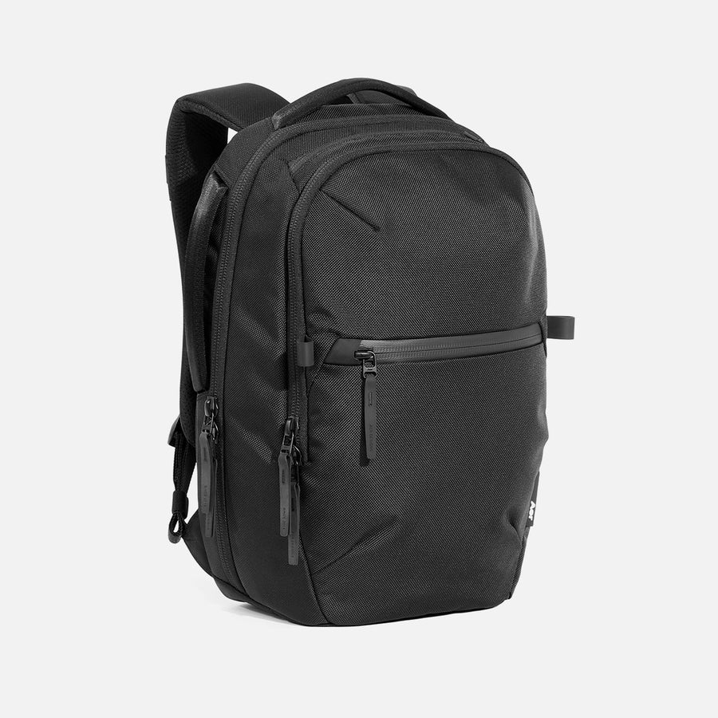
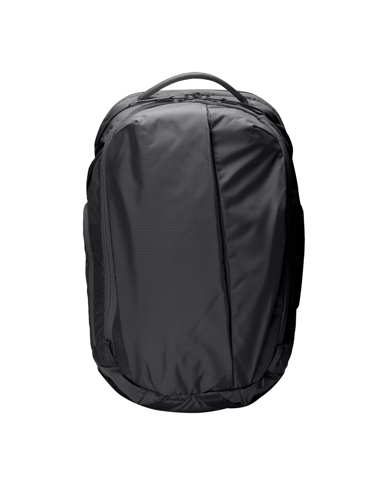

Shortlist of everyday carry backpacks. Prices are manufacturer list prices in USD and change over time — treat them as a rough ranking, not a quote.

## Aer City Pack 2

**16 l · $149** — compact city pack for daily commuting, built around a quick-access top pocket and an ergonomic harness.

- 1680D CORDURA ballistic nylon exterior with a nylon ripstop liner, both bluesign approved; YKK zippers and Duraflex hardware
- 46 × 30 × 14 cm, 1.1 kg
- Padded and suspended laptop pocket lined with soft fabric, fits up to a 16" laptop
- Exterior water bottle pocket, hidden tracker pocket, luggage handle pass-through, top and side grab handles

[aersf.com/products/city-pack-2](https://aersf.com/products/city-pack-2)

## Able Carry Max EDC

**26 l · $278** — larger three-compartment pack that takes a full day's kit plus a change of clothes, with a duffel-style front opening.

- re/cor Ripstop 210D nylon face fabric with 420D ripstop lining; also sold in an X-Pac version
- 50 × 30 × 19 cm, 1.47 kg
- Laptop compartment up to 17" (max 35.5 × 26 × 2.5 cm)
- Clamshell main compartment with zippered and stretch slip pockets, flexible admin pocket for bulky items, water bottle pockets
- Lifetime warranty

[ablecarry.com/products/max-edc-ripstop-black](https://ablecarry.com/products/max-edc-ripstop-black)
