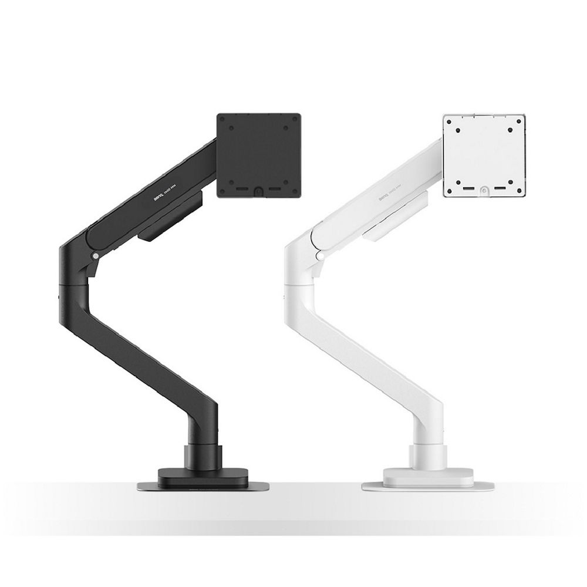
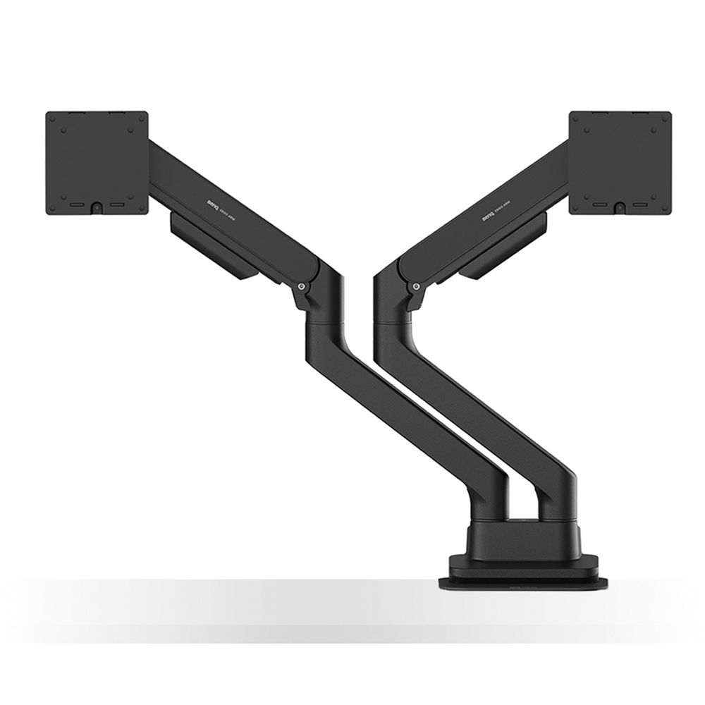
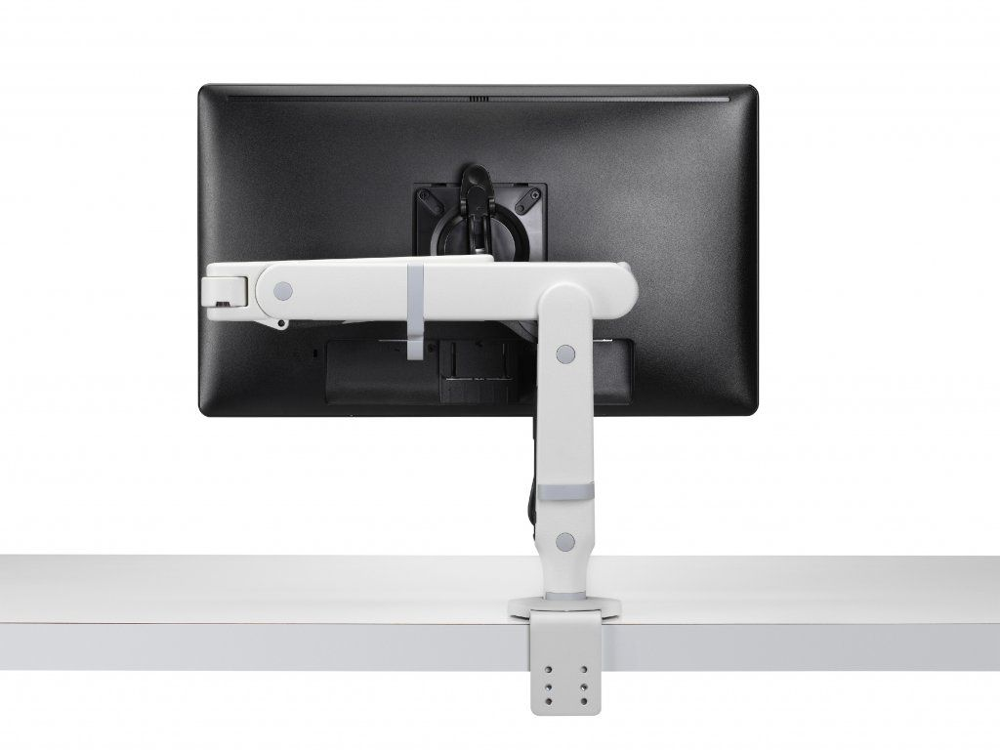
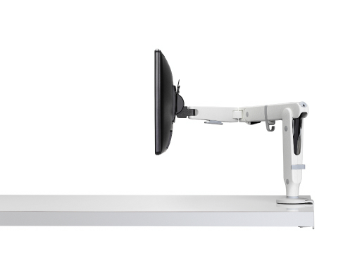
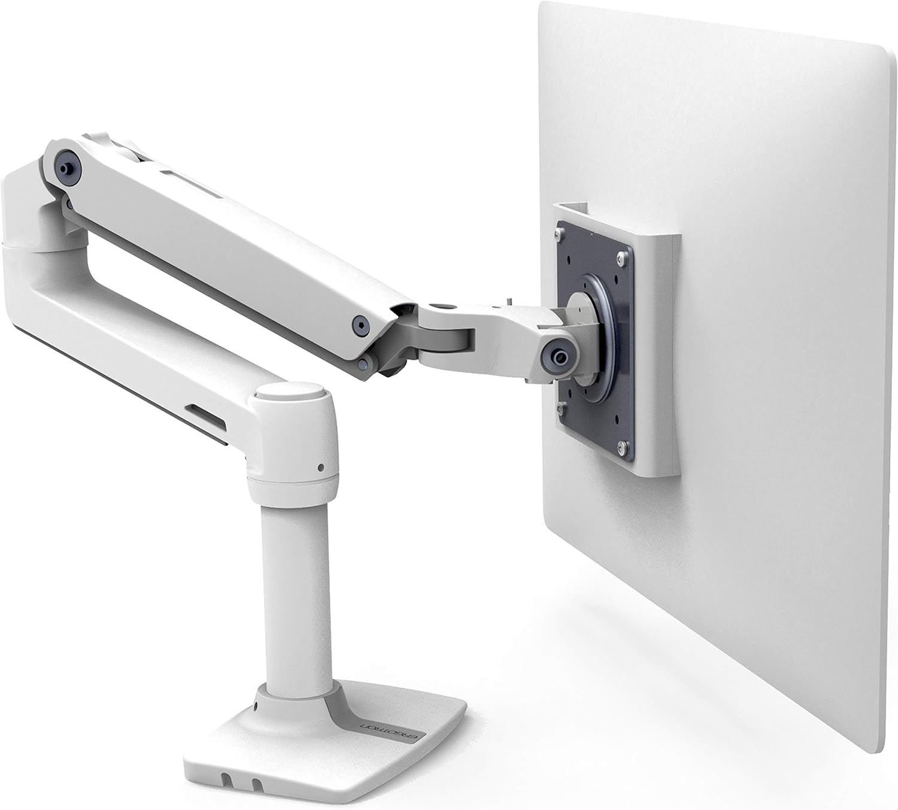
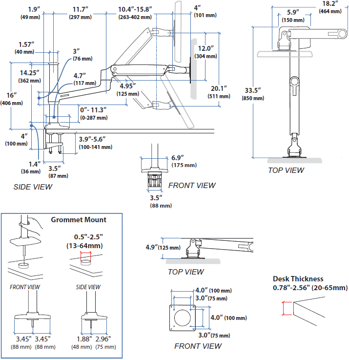

Přehled ergonomických ramen a držáků na monitor: BenQ Ergo Arm, CBS Ollin a Ergotron LX. U každého modelu jsou odkazy doplněné obrázkem; kliknutí na obrázek otevře příslušnou stránku. Parametry a zdroje ověřeny 6. října 2026.

## BenQ BSH01

**[BenQ Ergo Arm BSH01](https://www.benq.com/en-us/desk-tech/monitorarm/bsh01/buy.html)** — černé rameno pro jeden monitor o úhlopříčce **17–45″** a hmotnosti **2–20 kg**; podporuje VESA **75 × 75 a 100 × 100 mm**, plynovou pružinu a výztužnou desku pro uchycení ke stolu.

Na obrázku je také bílý BSH02; požadovaný BSH01 je vlevo.

## BenQ BDH01

**[BenQ Ergo Arm BDH01](https://www.benq.com/en-us/desk-tech/monitorarm/bdh01/buy.html)** — dvojité rameno pro dva monitory; **17–35″ a 2–20 kg na každé rameno**, VESA **75 × 75 a 100 × 100 mm**, společný stolní úchyt a samostatné polohování obrazovek.

## CBS Ollin

**[CBS Ollin — bílá sada včetně úchytu, cre8shop](https://www.cre8shop.cz/rameno-cbs-ollin-bile--vcetne-uchytu--sada/)** — rameno Colebrook Bosson Saunders pro jeden monitor s nosností **0–9 kg**, VESA **75 a 100 mm**, rotací na výšku i šířku a vedením kabelů; tato sada obsahuje úchyt na hranu desky **0–65 mm**.

**[Ollin Monitor Arms — Herman Miller](https://www.hermanmiller.com/en_eur/products/accessories/technology-support/ollin-monitor-arms/)** — oficiální přehled produktové rodiny Ollin s ukázkami polohování a variantou Ollin Dual.

**[CBS Ollin — vyhledávání Google](https://www.google.com/search?q=CBS+Ollin)** — původní vyhledávací odkaz, zkrácený bez sledovacích parametrů.

## Ergotron LX

**[Ergotron LX — bílý držák na Amazonu](https://www.amazon.com/dp/B01FW15TV6)** — rameno pro jeden monitor; uvedená nabídka uvádí displeje do **34″**, nosnost **7–25 lb (přibližně 3,2–11,3 kg)** a VESA **75 × 75 nebo 100 × 100 mm**.

Oba dodané odkazy na Amazon vedou na stejný produkt B01FW15TV6, proto je zde jediný záznam.

## Ergotron LX HD

**[Ergotron LX HD Sit-Stand — technický list výrobce](https://odm.ergotron.com/Portals/0/literature/productSheets/english/05-LX_HD_SitStandDMWM-EA.pdf)** — zde uvedená stolní varianta **45-384-026** pro těžší monitor; podle tohoto technického listu má nosnost **6,3–13,6 kg**, výškový zdvih **51 cm** a dosah až **84 cm**.

**[ErgoDirect — LX HD Sit-Stand 45-384-026](https://www.ergodirect.com/17795-ergotron-45-384-026-lx-hd-sit-stand-desk-mount-monitor-arm.html)** — produktová nabídka a zdroj technického obrázku.

:::note
LX a LX HD Sit-Stand jsou rozdílné modely. U LX HD ověřte konkrétní produktové číslo; zde je popsána stolní varianta 45-384-026, nikoli nástěnný držák.
:::
